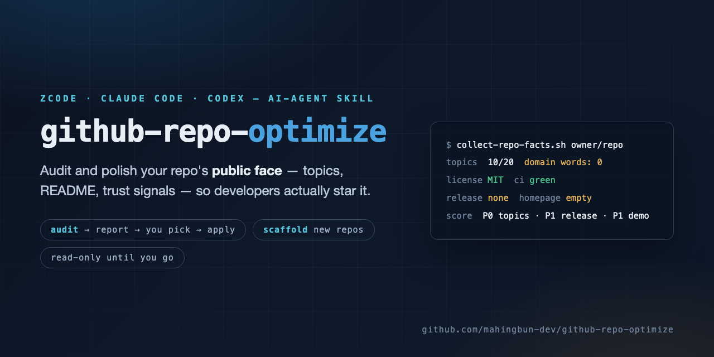

# github-repo-optimize

<p align="center"></p>

**An AI-agent skill that audits and polishes the public face of GitHub repositories — topics, README, description, trust signals — so your project gets discovered, trusted, and starred.**

English | [中文](README.zh-CN.md)

[](https://github.com/mahingbun-dev/github-repo-optimize/actions/workflows/ci.yml)
[](LICENSE)

Most repositories don't fail on code — they fail in the first 30 seconds: a description nobody can parse, an empty About box, a wall of badges before the first copyable command, three generic topics. This skill gives your AI coding agent a working checklist to fix that, in two modes:

- **Audit** — for existing repos. The agent collects read-only facts, scores six pillars (first impression, quick start, trust, content structure, discoverability, polish), and returns a prioritized checklist. Nothing is changed until you check off items.
- **Scaffold** — for new repos. It sets up the public face in the order that matters: description + topics first, then license, README skeleton, demo, social preview, first release.

## What's inside

| Asset | What your agent gets |
| --- | --- |
| `SKILL.md` | The workflow: mode selection, hard rules (every claim traceable, push always confirmed), report format, apply commands |
| `references/audit-checklist.md` | Six-pillar rubric with P0–P2 priorities and concrete fixes |
| `references/topics.md` | Topic playbook: four-bucket mix, comparable-repo research, hard constraints |
| `scripts/collect-repo-facts.sh` | One-shot read-only fact collection over `gh` (description, topics, README, releases, CI) |

## Install

```sh
git clone https://github.com/mahingbun-dev/github-repo-optimize
./github-repo-optimize/install.sh
```

Targets ZCode (`~/.agents/skills`), Claude Code (`~/.claude/skills`), and Codex CLI (`~/.codex/skills`); pick one with `--tool=zcode|claude|codex`. Requires the [`gh` CLI](https://cli.github.com) installed and logged in.

## 60-second start

Start a **fresh session** in your tool and say:

```text
帮我看看 owner/repo 这个仓库,star 一直上不去,做个体检
```

The agent runs `collect-repo-facts.sh`, scores the six pillars, and returns a report like:

| Pillar | Score | Diagnosis |
| --- | --- | --- |
| First impression | 4/5 | Concrete value proposition, but no demo image |
| Trust | 2/5 | No release, no CI badge |
| Discoverability | 2/5 | Topics missing problem-domain words |

Check off the items you want, and the agent applies them — `gh repo edit`, topic rewrites, README edits — with `git push` always confirmed separately. Reports follow your conversation language.

## Ground rules

- **Read-only until you say go.** Audits never touch the repo; writes are item-by-item, and pushes are always confirmed.
- **No fake appeal.** No bought stars, no keyword stuffing, no badges pointing at nothing — the skill flags those anti-patterns when it sees them.
- **Every claim traceable.** README statements must come from the code or from you; unverified numbers are marked, not invented.

## License

[MIT](LICENSE)
